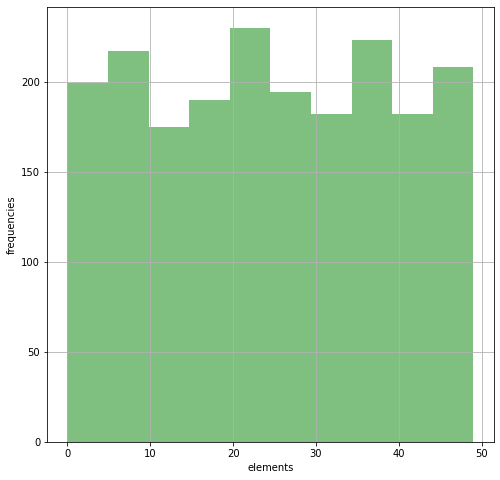

Tips an' Tricks
###############


.. raw:: html

   <p>

.. container::

   Massimo Nocentini, PhD. May 27, 2020: init

.. raw:: html

   </p>

.. container::

   Abstract Some tips, tricks and gotchas, in particular.

.. code:: ipython3

    __AUTHORS__ = {'am': ("Andrea Marino", 
                          "andrea.marino@unifi.it",),
                   'mn': ("Massimo Nocentini", 
                          "massimo.nocentini@unifi.it", 
                          "https://github.com/massimo-nocentini/",)}
    
    __KEYWORDS__ = ['Python', 'Jupyter', 'gotchas', 'keynote',]

.. raw:: html

   <center>

.. raw:: html

   </center>

Tips, tricks and gotchas
========================

This lecture addresses some gotchas that could arise in daily
programming; moreover, at the beginning we will introduce some helpful
objects that could make coding easier.

First of all, some imports as usual:

.. code:: ipython3

    from collections import defaultdict, Counter
    
    import matplotlib.pyplot as plt
    
    %matplotlib inline
    plt.rcParams['figure.figsize'] = (8, 8)

A grouping pattern, avoiding *quadratic* time
---------------------------------------------

Assume to have two lists that have to be related in some way, namely
using a predicate :math:`P`. In the following example we want to build a
list of all pairs (boy,girl) such that their names starts with the same
letter. Here the input:

.. code:: ipython3

    girls = ['alice', 'allie', 'bernice', 'brenda', 'clarice', 'cilly']
    boys = ['chris', 'christopher', 'arald', 'arnold', 'bob']

the bad way, quadratic time:

.. code:: ipython3

    [(b, g) for b in boys for g in girls if b[0] == g[0]]


.. parsed-literal::

    [('chris', 'clarice'),
     ('chris', 'cilly'),
     ('christopher', 'clarice'),
     ('christopher', 'cilly'),
     ('arald', 'alice'),
     ('arald', 'allie'),
     ('arnold', 'alice'),
     ('arnold', 'allie'),
     ('bob', 'bernice'),
     ('bob', 'brenda')]


there is a better approach avoiding quadratic time, toward
```defaultdict`` <https://docs.python.org/3/library/collections.html#defaultdict-objects>`__:

.. code:: ipython3

    letterGirls = {}
    for girl in girls:
        letterGirls.setdefault(girl[0], []).append(girl)
    
    [(b, g) for b in boys for g in letterGirls[b[0]]]


.. parsed-literal::

    [('chris', 'clarice'),
     ('chris', 'cilly'),
     ('christopher', 'clarice'),
     ('christopher', 'cilly'),
     ('arald', 'alice'),
     ('arald', 'allie'),
     ('arnold', 'alice'),
     ('arnold', 'allie'),
     ('bob', 'bernice'),
     ('bob', 'brenda')]


However there is an even better solution, as pointed out in the
`example <https://docs.python.org/3/library/collections.html#defaultdict-examples>`__
subsection of the previous link: use ``defaultdict`` instead of
repeating call ``setdefault`` method for each new key. From the official
documentation:

.. code:: ipython3

    >>> s = [('yellow', 1), ('blue', 2), ('yellow', 3), ('blue', 4), ('red', 1)]
    >>> d = defaultdict(list)
    >>> for k, v in s:
    ...     d[k].append(v)
    ...
    >>> list(d.items())
    [('blue', [2, 4]), ('red', [1]), ('yellow', [1, 3])]


.. parsed-literal::

    [('blue', [2, 4]), ('red', [1]), ('yellow', [1, 3])]


The *Bunch* pattern
-------------------

A very good book on algorithms implemented in Python is the one by
Magnus Hetland, https://www.apress.com/gp/book/9781484200568, with the
companion Github repository
https://github.com/apress/python-algorithms-14.

Hetland, pag. 34, propose the following pattern to build a container of
properties in order to avoid vanilla dict (adjusting from item 4.18 of
Alex Martelli’s `Python
Cookbook <http://shop.oreilly.com/product/9780596007973.do>`__):

.. code:: ipython3

    class Bunch(dict):
        def __init__(self, *args, **kwds):
            super(Bunch, self).__init__(*args, **kwds)
            self.__dict__ = self

.. code:: ipython3

    >>> T = Bunch
    >>> t = T(left=T(left="a", right="b"), right=T(left="c"))
    >>> t.left


.. parsed-literal::

    {'left': 'a', 'right': 'b'}


.. code:: ipython3

    >>> t.left.right


.. parsed-literal::

    'b'


.. code:: ipython3

    >>> t['left']['right']


.. parsed-literal::

    'b'


.. code:: ipython3

    >>> "left" in t.right


.. parsed-literal::

    True


.. code:: ipython3

    "right" in t.right


.. parsed-literal::

    False


However, inheriting from ``dict`` is discouraged by Alex:

   A further tempting but not fully sound alternative is to have the
   Bunch class inherit from ``dict``, and set attribute access special
   methods equal to the item access special methods, as follows:

::

   class DictBunch(dict):
       __getattr__ = dict.__getitem__
       __setattr__ = dict.__setitem__
       __delattr__ = dict.__delitem__

..

   One problem with this approach is that, with this definition, an
   instance x of ``DictBunch`` has many attributes it doesn’t really
   have, because it inherits all the attributes (methods, actually, but
   there’s no significant difference in this context) of ``dict``. So,
   you can’t meaningfully check ``hasattr(x, someattr)`` , as you could
   with the classes ``Bunch`` and ``EvenSimplerBunch`` (which sets the
   dictionary directly, without using ``update``) previously shown,
   unless you can somehow rule out the value of someattr being any of
   several common words such as ``keys`` , ``pop`` , and ``get``.
   Python’s distinction between attributes and items is really a
   wellspring of clarity and simplicity. Unfortunately, many newcomers
   to Python wrongly believe that it would be better to confuse items
   with attributes, generally because of previous experience with
   JavaScript and other such languages, in which attributes and items
   are regularly confused. But educating newcomers is a much better idea
   than promoting item/ attribute confusion.

Alex original definition reads as follows:

.. code:: ipython3

    class Bunch(object):
        def __init__(self, **kwds):
            self.__dict__.update(kwds)

It is interesting to observe that this idiom has been merged within the
*standard library*, starting from Python **3.3**, as with the name of
```SimpleNamespace`` <https://docs.python.org/3/library/types.html#types.SimpleNamespace>`__:

.. code:: ipython3

    from types import SimpleNamespace
    
    x, y = 32, 64
    point = SimpleNamespace(datum=y, squared=y*y, coord=x)
    point


.. parsed-literal::

    namespace(datum=64, squared=4096, coord=32)


.. code:: ipython3

    point.datum, point.squared, point.coord


.. parsed-literal::

    (64, 4096, 32)


.. code:: ipython3

    [i for i in point]


::


    ---------------------------------------------------------------------------

    TypeError                                 Traceback (most recent call last)

    <ipython-input-18-70c474fd2112> in <module>
    ----> 1 [i for i in point]
    

    TypeError: 'types.SimpleNamespace' object is not iterable


If you need ``point`` to be iterable use the structured object
```namedtuple`` <https://docs.python.org/3/library/collections.html#collections.namedtuple>`__
instead.

Python’s ``list.append`` isn’t Lisp’s ``cons``
----------------------------------------------

Python ``list`` objects behave like ``stack`` objects, such that it is
*cheap* to ``append`` and ``pop`` at the *top*, which is the *right*
end. On the other hand, Lisp ``pair`` objects allows us to *easily*
``cons`` on the *beginning*, the very *opposite* direction.

.. code:: ipython3

    def fast_countdown(count):
        nums = []
        for i in range(count):
            nums.append(i)
        nums.reverse()
        return nums
    
    def slow_countdown(count):
        nums = []
        for i in range(count):
            nums.insert(0, i)
        return nums
    
    def printer(lst, chunk=10):
        print("{}...{}".format(" ".join(map(str, lst[:chunk])),
                               " ".join(map(str, lst[-chunk:]))))

.. code:: ipython3

    %timeit nums = fast_countdown(10**5)


.. parsed-literal::

    5.13 ms ± 118 µs per loop (mean ± std. dev. of 7 runs, 100 loops each)


.. code:: ipython3

    %timeit nums = slow_countdown(10**5)


.. parsed-literal::

    1.61 s ± 13.2 ms per loop (mean ± std. dev. of 7 runs, 1 loop each)


Citing Hetland, pag 11:

   Python lists aren’t really lists in the traditional computer science
   sense of the word, and that explains the puzzle of why append is so
   much more efficient than insert . A classical list - a so-called
   linked list - is implemented as a series of nodes, each (except for
   the last) keeping a reference to the next. The underlying
   implementation of Python’s list type is a bit different. Instead of
   several separate nodes referencing each other, a list is basically a
   single, contiguous slab of memory - what is usually known as an
   array. This leads to some important differences from linked lists.
   For example, while iterating over the contents of the list is equally
   efficient for both kinds (except for some overhead in the linked
   list), directly accessing an element at a given index is much more
   efficient in an array. This is because the position of the element
   can be calculated, and the right memory location can be accessed
   directly. In a linked list, however, one would have to traverse the
   list from the beginning. The difference we’ve been bumping up
   against, though, has to do with insertion. In a linked list, once you
   know where you want to insert something, insertion is cheap; it takes
   roughly the same amount of time, no matter how many elements the list
   contains. That’s not the case with arrays: An insertion would have to
   move all elements that are to the right of the insertion point,
   possibly even moving all the elements to a larger array, if needed. A
   specific solution for appending is to use what’s often called a
   dynamic array, or vector. 4 The idea is to allocate an array that is
   too big and then to reallocate it in linear time whenever it
   overflows. It might seem that this makes the append just as bad as
   the insert. In both cases, we risk having to move a large number of
   elements. The main difference is that it happens less often with the
   append. In fact, if we can ensure that we always move to an array
   that is bigger than the last by a fixed percentage (say 20 percent or
   even 100 percent), the average cost, amortized over many appends, is
   constant.

enhance with ``deque`` objects
~~~~~~~~~~~~~~~~~~~~~~~~~~~~~~

``deque`` implements *FIFO* queues: they are as cheap to append to the
right as a normal ``list``, but enhance it to *cheaply* insert on the
*front* too.

.. code:: ipython3

    from collections import deque
    
    def enhanced_slow_countdown(count):
        nums = deque()
        for i in range(count):
            nums.appendleft(i)
        return nums

.. code:: ipython3

    %timeit nums = enhanced_slow_countdown(10**5)


.. parsed-literal::

    5.19 ms ± 159 µs per loop (mean ± std. dev. of 7 runs, 100 loops each)


Hidden squares: concerning ``list``\ s and ``set``\ s
-----------------------------------------------------

.. code:: ipython3

    from random import randrange
    
    max_value = 10000
    checks = 1000
    L = [randrange(max_value) for i in range(checks)]

.. code:: ipython3

    %timeit [randrange(max_value) in L for _ in range(checks)]


.. parsed-literal::

    12.7 ms ± 644 µs per loop (mean ± std. dev. of 7 runs, 100 loops each)


.. code:: ipython3

    S = set(L) # convert the list to a set object.
    
    %timeit [randrange(max_value) in S for _ in range(checks)]


.. parsed-literal::

    439 µs ± 31.6 µs per loop (mean ± std. dev. of 7 runs, 1000 loops each)


Hetland’s words, pag. 35:

   They’re both pretty fast, and it might seem pointless to create a set
   from the list—unnecessary work, right? Well, it depends. If you’re
   going to do many membership checks, it might pay off, because
   membership checks are linear for lists and constant for sets. What
   if, for example, you were to gradually add values to a collection and
   for each step check whether the value was already added? […] Using a
   list would give you quadratic running time, whereas using a set would
   be linear. That’s a huge difference. **The lesson is that it’s
   important to pick the right built-in data structure for the job.**

.. code:: ipython3

    lists = [[1, 2], [3, 4, 5], [6]]
    sum(lists, [])


.. parsed-literal::

    [1, 2, 3, 4, 5, 6]


Hetland, pag.36:

   This works, and it even looks rather elegant, but it really isn’t.
   You see, under the covers, the sum function doesn’t know all too much
   about what you’re summing, and it has to do one addition after
   another. That way, you’re right back at the quadratic running time of
   the += example for strings. Here’s a better way: Just try timing both
   versions. As long as lists is pretty short, there won’t be much
   difference, but it shouldn’t take long before the sum version is
   thoroughly beaten.

.. code:: ipython3

    res = []
    for lst in lists:
        res.extend(lst)
    res


.. parsed-literal::

    [1, 2, 3, 4, 5, 6]


try to do that with more populated lists…

concerning ``string``\ s
~~~~~~~~~~~~~~~~~~~~~~~~

.. code:: ipython3

    def string_producer(length):
        return ''.join([chr(randrange(ord('a'), ord('z'))) for _ in range(length)])

.. code:: ipython3

    %%timeit 
    
    s = ""
    for chunk in string_producer(10**5):
        s += chunk


.. parsed-literal::

    74.4 ms ± 5.29 ms per loop (mean ± std. dev. of 7 runs, 10 loops each)


maybe some optimization is performed because ``s`` is a ``string``
object.

.. code:: ipython3

    %%timeit
    
    chunks = []
    for chunk in string_producer(10**5):
        chunks.append(chunk)
    s = ''.join(chunks)


.. parsed-literal::

    61.5 ms ± 1.27 ms per loop (mean ± std. dev. of 7 runs, 10 loops each)


a better approach using constant ``append`` to the top

.. code:: ipython3

    %timeit s = ''.join(string_producer(10**5))


.. parsed-literal::

    60.1 ms ± 2.26 ms per loop (mean ± std. dev. of 7 runs, 10 loops each)


maybe a little better since it doesn’t loop with ``for`` explicitly.

Counting
========

Max permutation
---------------

   Eight persons with very particular tastes have bought tickets to the
   movies. Some of them are happy with their seats, but most of them are
   not. Let’s say each of them has a favorite seat, and you want to find
   a way to let them switch seats to make as many people as possible
   happy with the result. However, all of them refuse to move to another
   seat if they can’t get their favorite.

The following function ``max_perm`` computes the maximum permutation
that can be applied given a desired one; namely, it produces a new
permutation that moves as many elements as it can, in order to ensure
the ``one-to-one`` property – no one in the set points outside it, and
each seat (in the set) is pointed to exactly once. It can be seen as a
function that *fixes* a given permutation according to the required
behavior.

.. code:: ipython3

    def perm_isomorphism(M, domain):
        iso = dict(enumerate(domain))
        return [iso[M[i]] for i in range(len(M))]
    
    def fix_perm(M, fix):
        return [M[i] if i in fix else i for i in range(len(M))]

The following is a naive implementation, recursive but in
:math:`\mathcal{O}(n^{2})`, where :math:`n` is the permutation length.

.. code:: ipython3

    def naive_max_perm(M, A=None):
        '''
        Fix a permutation such that it is one-to-one and maximal, recursively.
        
        consumes:
        M - a permutation as a list of integers
        A - a set of positions allowed to move
        
        produces:
        a set `fix` such that makes M maximal, ensuring to be one-to-one
        '''
        if A is None: A = set(range(len(M))) # init to handle first invocation, all elems can move
        
        if len(A) == 1: return A # recursion base, unary perm can move, trivial
        
        B = set(M[i] for i in A) # b in B iff b is desired by someone
        C = A - B # c in C iff c isn't desired, so discard it
        return naive_max_perm(M, A - C) if C else A # recur with desired position only

.. code:: ipython3

    I = range(8) # the identity permutation
    letters = "abcdefgh"
    perm_isomorphism(I, letters)


.. parsed-literal::

    ['a', 'b', 'c', 'd', 'e', 'f', 'g', 'h']


.. code:: ipython3

    M = [2, 2, 0, 5, 3, 5, 7, 4]
    perm_isomorphism(M, letters)


.. parsed-literal::

    ['c', 'c', 'a', 'f', 'd', 'f', 'h', 'e']


.. code:: ipython3

    fix = naive_max_perm(M)
    max_M = fix_perm(M, fix)
    perm_isomorphism(max_M, letters)


.. parsed-literal::

    ['c', 'b', 'a', 'd', 'e', 'f', 'g', 'h']


Hetland, pag. 78:

   The function ``naive_max_perm`` receives a set ``A`` of remaining
   people and creates a set ``B`` of seats that are pointed to. If it
   finds an element in ``A`` that is not in ``B``, it removes the
   element and solves the remaining problem recursively. Let’s use the
   implementation on our example, M = ``[2, 2, 0, 5, 3, 5, 7, 4]``:

.. code:: ipython3

    naive_max_perm(M)


.. parsed-literal::

    {0, 2, 5}


   So, a, c, and f can take part in the permutation. The others will
   have to sit in nonfavorite seats. The implementation isn’t too bad.
   The handy set type lets us manipulate sets with ready-made high-level
   operations, rather than having to implement them ourselves. There are
   some problems, though. For one thing, we might want an iterative
   solution. […] A worse problem, though, is that the algorithm is
   quadratic! (Exercise 4-10 asks you to show this.) The most wasteful
   operation is the repeated creation of the set B. If we could just
   keep track of which chairs are no longer pointed to, we could
   eliminate this operation entirely. One way of doing this would be to
   keep a count for each element. We could decrement the count for chair
   x when a person pointing to x is eliminated, and if x ever got a
   count of zero, both person and chair x would be out of the game.
   >This idea of reference counting can be useful in general. It is, for
   example, a basic component in many systems for garbage collection (a
   form of memory management that automatically deallocates objects that
   are no longer useful). You’ll see this technique again in the
   discussion of topological sorting.

   There may be more than one element to be eliminated at any one time,
   but we can just put any new ones we come across into a “to-do” list
   and deal with them later. If we needed to make sure the elements were
   eliminated in the order in which we discover that they’re no longer
   useful, we would need to use a first-in, first-out queue such as the
   deque class (discussed in Chapter 5). We don’t really care, so we
   could use a set, for example, but just appending to and popping from
   a list will probably give us quite a bit less overhead. But feel free
   to experiment, of course.

.. code:: ipython3

    def max_perm(M):
        n = len(M) # How many elements?
        A = set(range(n)) # A = {0, 1, ... , n-1}
        count = Counter(M) # desired positions by frequencies
        Q = deque([i for i in A if not count[i]]) # useless elements
        while Q: # While useless elts. left...
            i = Q.pop() # get one of them
            A.remove(i) # remove it from the maximal permutation
            j = M[i] # get its desired position
            count[j] -= 1 # and release it for someone else
            if not count[j]: # if such position isn't desired anymore
                Q.appendleft(j) # enqueue such position in order to discard it            
        return A

.. code:: ipython3

    fix = max_perm(M)
    max_M = fix_perm(M, fix)
    perm_isomorphism(max_M, letters)


.. parsed-literal::

    ['c', 'b', 'a', 'd', 'e', 'f', 'g', 'h']


Counting Sort
-------------

Hetland, pag 85:

   By default, I’m just sorting objects based on their values. By
   supplying a key function, you can sort by anything you’d like. Note
   that the keys must be integers in a limited range. If this range is
   :math:`0\ldots k-1`, running time is then :math:`\mathcal{O}(n + k)`.
   (Note that although the common implementation simply counts the
   elements and then figures out where to put them in ``B``, Python
   makes it easy to just build value lists for each key and then
   concatenate them.) If several values have the same key, they’ll end
   up in the original order with respect to each other. Sorting
   algorithms with this property are called *stable*.

.. code:: ipython3

    def counting_sort(A, key=None, sort_boundary=None):
        '''
        Sorts the given collection A in linear time, assuming their elements are hashable.
        
        This implementation implements a vanilla counting sort, working in linear time respect
        iterable length and spacing between objects. It works best if elements are evenly, namely
        *uniformly* distributed in the domain; on contrast, if they are sparse and concentrated 
        near accumulation points, traversing distances between them is time consuming. 
        
        If `sort_boundary` is instantiated to a float within [0,1], then the domain is ordered
        using a classic loglinear algorithm before building the result.
        '''
        if key is None: key = lambda x: x
            
        B, C = [], defaultdict(list)
        for x in A:
            C[key(x)].append(x)
        
        domain = sorted(C)  if sort_boundary and len(C) <= len(A)*sort_boundary \
                            else range(min(C), max(C)+1)
        for k in domain:
            B.extend(C[k])
            
        return B

.. code:: ipython3

    A = [randrange(50) for i in range(2*10**3)]
    
    assert sorted(A) == counting_sort(A)

.. code:: ipython3

    n, bins, patches = plt.hist(A, 10, facecolor='green', alpha=0.5)
    plt.xlabel('elements'); plt.ylabel('frequencies'); plt.grid(True)
    plt.show()





.. code:: ipython3

    %timeit counting_sort(A)


.. parsed-literal::

    219 µs ± 10.7 µs per loop (mean ± std. dev. of 7 runs, 1000 loops each)


.. code:: ipython3

    %timeit counting_sort(A, sort_boundary=1)


.. parsed-literal::

    206 µs ± 8.96 µs per loop (mean ± std. dev. of 7 runs, 1000 loops each)


.. code:: ipython3

    B = ([randrange(50) for i in range(10**3)] + 
         [10**4 + randrange(50) for i in range(10**3)])

.. code:: ipython3

    n, bins, patches = plt.hist(B, 100, facecolor='green', alpha=0.5)
    plt.xlabel('elements'); plt.ylabel('frequencies'); plt.grid(True)
    plt.show()


.. image:: gotchas_files/gotchas_79_0.png


.. code:: ipython3

    assert sorted(B) == counting_sort(B)

.. code:: ipython3

    %timeit counting_sort(B)


.. parsed-literal::

    2.01 ms ± 136 µs per loop (mean ± std. dev. of 7 runs, 100 loops each)


.. code:: ipython3

    %timeit counting_sort(B, sort_boundary=1/8)


.. parsed-literal::

    247 µs ± 20.4 µs per loop (mean ± std. dev. of 7 runs, 1000 loops each)

