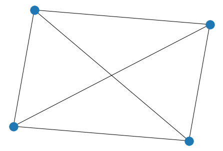
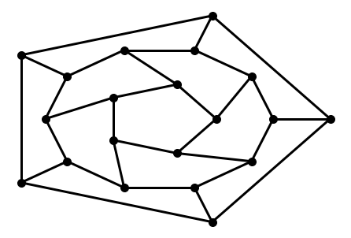

networkx module
###################

``NetworkX``
------------

https://github.com/networkx/networkx

Aric A. Hagberg, Daniel A. Schult and Pieter J. Swart, `“Exploring
network structure, dynamics, and function using NetworkX”, in
Proceedings of the 7th Python in Science Conference
(SciPy2008) <http://conference.scipy.org/proceedings/SciPy2008/paper_2/>`__,
Gäel Varoquaux, Travis Vaught, and Jarrod Millman (Eds), (Pasadena, CA
USA), pp. 11–15, Aug 2008
(`pdf <http://math.lanl.gov/~hagberg/Papers/hagberg-2008-exploring.pdf>`__).

This content is originally downloaded from
https://networkx.github.io/documentation/stable/tutorial.html and
adapted to be shown as a presentation; moreover, we mix in additional
resources such as examples (citing them and the original authors) in the
last section.

Creating a graph
~~~~~~~~~~~~~~~~

Create an empty graph with no nodes and no edges.

.. code:: ipython3

    import networkx as nx
    G = nx.Graph()

By definition, a ``Graph`` is a collection of nodes (vertices) along
with identified pairs of nodes (called edges, links, etc). In NetworkX,
nodes can be any *hashable* object e.g., a text string, an image, an XML
object, another Graph, a customized node object, etc.

   An object is hashable if it has a hash value which never changes
   during its lifetime (it needs a ``__hash__()`` method), and can be
   compared to other objects (it needs an ``__eq__()`` method). Hashable
   objects which compare equal must have the same hash value.

Nodes
=====

The graph ``G`` can be grown in several ways. NetworkX includes many
graph generator functions and facilities to read and write graphs in
many formats. To get started though we’ll look at simple manipulations.
You can add one node at a time,

.. code:: ipython3

    G.add_node(1)

add a list of nodes,

.. code:: ipython3

    G.add_nodes_from([2, 3])

or add any iterable container of nodes. You can also add nodes along
with node attributes if your container yields 2-tuples (node,
node_attribute_dict). Node attributes are discussed further below.

.. code:: ipython3

    H = nx.path_graph(10)
    G.add_nodes_from(H)

Note that ``G`` now contains the nodes of ``H`` as nodes of ``G``. In
contrast, you could use the graph ``H`` as a node in ``G``.

.. code:: ipython3

    G.add_node(H)

The graph ``G`` now contains ``H`` as a node. This flexibility is very
powerful as it allows graphs of graphs, graphs of files, graphs of
functions and much more. It is worth thinking about how to structure
your application so that the nodes are useful entities. Of course you
can always use a unique identifier in ``G`` and have a separate
dictionary keyed by identifier to the node information if you prefer.

Edges
=====

``G`` can also be grown by adding one edge at a time,

.. code:: ipython3

    G.add_edge(1, 2)
    e = (2, 3)
    G.add_edge(*e)  # unpack edge tuple*

by adding a list of edges,

.. code:: ipython3

    G.add_edges_from([(1, 2), (1, 3)])

or by adding any ebunch of edges. An *ebunch* is any iterable container
of edge-tuples. An edge-tuple can be a 2-tuple of nodes or a 3-tuple
with 2 nodes followed by an edge attribute dictionary, e.g.,
``(2, 3, {'weight': 3.1415})``. Edge attributes are discussed further
below

.. code:: ipython3

    G.add_edges_from(H.edges)

There are no complaints when adding existing nodes or edges. For
example, after removing all nodes and edges,

.. code:: ipython3

    G.clear()

we add new nodes/edges and NetworkX quietly ignores any that are already
present.

.. code:: ipython3

    G.add_edges_from([(1, 2), (1, 3)])
    G.add_node(1)
    G.add_edge(1, 2)
    G.add_node("spam")        # adds node "spam"
    G.add_nodes_from("spam")  # adds 4 nodes: 's', 'p', 'a', 'm'
    G.add_edge(3, 'm')

At this stage the graph ``G`` consists of 8 nodes and 3 edges, as can be
seen by:

.. code:: ipython3

    G.number_of_nodes()

.. parsed-literal::

    8

.. code:: ipython3

    G.number_of_edges()

.. parsed-literal::

    3

We can examine the nodes and edges. Four basic graph properties
facilitate reporting: ``G.nodes``, ``G.edges``, ``G.adj`` and
``G.degree``. These are set-like views of the nodes, edges, neighbors
(adjacencies), and degrees of nodes in a graph. They offer a continually
updated read-only view into the graph structure. They are also dict-like
in that you can look up node and edge data attributes via the views and
iterate with data attributes using methods ``.items()``,
``.data('span')``. If you want a specific container type instead of a
view, you can specify one. Here we use lists, though sets, dicts, tuples
and other containers may be better in other contexts.

.. code:: ipython3

    list(G.nodes)

.. parsed-literal::

    [1, 2, 3, 'spam', 's', 'p', 'a', 'm']

.. code:: ipython3

    list(G.edges)

.. parsed-literal::

    [(1, 2), (1, 3), (3, 'm')]

.. code:: ipython3

    list(G.adj[1])  # or list(G.neighbors(1))

.. parsed-literal::

    [2, 3]

.. code:: ipython3

    
    G.degree[1]  # the number of edges incident to 1

.. parsed-literal::

    2

One can specify to report the edges and degree from a subset of all
nodes using an *nbunch*. An *nbunch* is any of: None (meaning all
nodes), a node, or an iterable container of nodes that is not itself a
node in the graph.

.. code:: ipython3

    G.edges([2, 'm']), G.degree([2, 3])

.. parsed-literal::

    (EdgeDataView([(2, 1), ('m', 3)]), DegreeView({2: 1, 3: 2}))

One can remove nodes and edges from the graph in a similar fashion to
adding. Use methods ``Graph.remove_node()``,
``Graph.remove_nodes_from()``, ``Graph.remove_edge()`` and
``Graph.remove_edges_from()``, e.g.

.. code:: ipython3

    G.remove_node(2)
    G.remove_nodes_from("spam")
    list(G.nodes)

.. parsed-literal::

    [1, 3, 'spam']

.. code:: ipython3

    G.remove_edge(1, 3)

When creating a graph structure by instantiating one of the graph
classes you can specify data in several formats.

.. code:: ipython3

    G.add_edge(1, 2)
    H = nx.DiGraph(G)   # create a DiGraph using the connections from G
    list(H.edges())

.. parsed-literal::

    [(1, 2), (2, 1)]

.. code:: ipython3

    edgelist = [(0, 1), (1, 2), (2, 3)]
    H = nx.Graph(edgelist)

What to use as nodes and edges
==============================

You might notice that nodes and edges are not specified as NetworkX
objects. This leaves you free to use meaningful items as nodes and
edges. The most common choices are numbers or strings, but a node can be
any hashable object (except ``None``), and an edge can be associated
with any object ``x`` using ``G.add_edge(n1, n2, object=x)``.

As an example, ``n1`` and ``n2`` could be protein objects from the RCSB
Protein Data Bank, and ``x`` could refer to an XML record of
publications detailing experimental observations of their interaction.

We have found this power quite useful, but its abuse can lead to
unexpected surprises unless one is familiar with Python. If in doubt,
consider using ``convert_node_labels_to_integers()`` to obtain a more
traditional graph with integer labels.

Accessing edges and neighbors
=============================

In addition to the views ``Graph.edges()``, and ``Graph.adj()``, access
to edges and neighbors is possible using subscript notation.

.. code:: ipython3

    G[1]  # same as G.adj[1]

.. parsed-literal::

    AtlasView({2: {}})

.. code:: ipython3

    G[1][2], G.edges[1, 2]

.. parsed-literal::

    ({}, {})

You can get/set the attributes of an edge using subscript notation if
the edge already exists.

.. code:: ipython3

    G.add_edge(1, 3)
    G[1][3]['color'] = "blue"
    G.edges[1, 2]['color'] = "red"

Fast examination of all (node, adjacency) pairs is achieved using
``G.adjacency()``, or ``G.adj.items()``. Note that for undirected
graphs, adjacency iteration sees each edge twice.

.. code:: ipython3

    FG = nx.Graph()
    FG.add_weighted_edges_from(
        [(1, 2, 0.125), (1, 3, 0.75), (2, 4, 1.2), (3, 4, 0.375)])
    for n, nbrs in FG.adj.items():
       for nbr, eattr in nbrs.items():
           wt = eattr['weight']
           if wt < 0.5: print('(%d, %d, %.3f)' % (n, nbr, wt))

.. parsed-literal::

    (1, 2, 0.125)
    (2, 1, 0.125)
    (3, 4, 0.375)
    (4, 3, 0.375)

Convenient access to all edges is achieved with the edges property.

.. code:: ipython3

    for (u, v, wt) in FG.edges.data('weight'):
        if wt < 0.5: print('(%d, %d, %.3f)' % (u, v, wt))

.. parsed-literal::

    (1, 2, 0.125)
    (3, 4, 0.375)

Adding attributes to graphs, nodes, and edges
=============================================

Attributes such as weights, labels, colors, or whatever Python object
you like, can be attached to graphs, nodes, or edges.

Each graph, node, and edge can hold key/value attribute pairs in an
associated attribute dictionary (the keys must be hashable). By default
these are empty, but attributes can be added or changed using
``add_edge``, ``add_node`` or direct manipulation of the attribute
dictionaries named ``G.graph``, ``G.nodes``, and ``G.edges`` for a graph
``G``.

Graph attributes
----------------

Assign graph attributes when creating a new graph

.. code:: ipython3

    G = nx.Graph(day="Friday")
    G.graph

.. parsed-literal::

    {'day': 'Friday'}

Or you can modify attributes later

.. code:: ipython3

    G.graph['day'] = "Monday"
    G.graph

.. parsed-literal::

    {'day': 'Monday'}

Node attributes
===============

Add node attributes using ``add_node()``, ``add_nodes_from()``, or
``G.nodes``

.. code:: ipython3

    G.add_node(1, time='5pm')
    G.add_nodes_from([3], time='2pm')
    G.nodes[1]

.. parsed-literal::

    {'time': '5pm'}

.. code:: ipython3

    G.nodes[1]['room'] = 714
    G.nodes.data()

.. parsed-literal::

    NodeDataView({1: {'time': '5pm', 'room': 714}, 3: {'time': '2pm'}})

Note that adding a node to ``G.nodes`` does not add it to the graph, use
``G.add_node()`` to add new nodes. Similarly for edges.

Edge Attributes
===============

Add/change edge attributes using ``add_edge()``, ``add_edges_from()``,
or subscript notation.

.. code:: ipython3

    G.add_edge(1, 2, weight=4.7 )
    G.add_edges_from([(3, 4), (4, 5)], color='red')
    G.add_edges_from([(1, 2, {'color': 'blue'}), (2, 3, {'weight': 8})])
    G[1][2]['weight'] = 4.7
    G.edges[3, 4]['weight'] = 4.2

The special attribute ``weight`` should be numeric as it is used by
algorithms requiring weighted edges.

Directed graphs

The ``DiGraph`` class provides additional properties specific to
directed edges, e.g., ``DiGraph.out_edges()``, ``DiGraph.in_degree()``,
``DiGraph.predecessors()``, ``DiGraph.successors()`` etc. To allow
algorithms to work with both classes easily, the directed versions of
``neighbors()`` is equivalent to ``successors()`` while ``degree``
reports the sum of ``in_degree`` and ``out_degree`` even though that may
feel inconsistent at times.

.. code:: ipython3

    DG = nx.DiGraph()
    DG.add_weighted_edges_from([(1, 2, 0.5), (3, 1, 0.75)])
    DG.out_degree(1, weight='weight'), DG.degree(1, weight='weight')

.. parsed-literal::

    (0.5, 1.25)

.. code:: ipython3

    list(DG.successors(1)), list(DG.neighbors(1))

.. parsed-literal::

    ([2], [2])

Some algorithms work only for directed graphs and others are not well
defined for directed graphs. Indeed the tendency to lump directed and
undirected graphs together is dangerous. If you want to treat a directed
graph as undirected for some measurement you should probably convert it
using ``Graph.to_undirected()`` or with

.. code:: ipython3

    H = nx.Graph(G)  # convert G to undirected graph

Multigraphs
===========

NetworkX provides classes for graphs which allow multiple edges between
any pair of nodes. The ``MultiGraph`` and ``MultiDiGraph`` classes allow
you to add the same edge twice, possibly with different edge data. This
can be powerful for some applications, but many algorithms are not well
defined on such graphs. Where results are well defined, e.g.,
``MultiGraph.degree()`` we provide the function. Otherwise you should
convert to a standard graph in a way that makes the measurement well
defined.

.. code:: ipython3

    MG = nx.MultiGraph()
    MG.add_weighted_edges_from([(1, 2, 0.5), (1, 2, 0.75), (2, 3, 0.5)])
    dict(MG.degree(weight='weight'))

.. parsed-literal::

    {1: 1.25, 2: 1.75, 3: 0.5}

.. code:: ipython3

    GG = nx.Graph()
    for n, nbrs in MG.adjacency():
       for nbr, edict in nbrs.items():
           minvalue = min([d['weight'] for d in edict.values()])
           GG.add_edge(n, nbr, weight = minvalue)
    
    nx.shortest_path(GG, 1, 3)

.. parsed-literal::

    [1, 2, 3]

Graph generators and graph operations
=====================================

In addition to constructing graphs node-by-node or edge-by-edge, they
can also be generated by

1. Applying classic graph operations, such as:

   ::

      subgraph(G, nbunch)      - induced subgraph view of G on nodes in nbunch
      union(G1,G2)             - graph union
      disjoint_union(G1,G2)    - graph union assuming all nodes are different
      cartesian_product(G1,G2) - return Cartesian product graph
      compose(G1,G2)           - combine graphs identifying nodes common to both
      complement(G)            - graph complement
      create_empty_copy(G)     - return an empty copy of the same graph class
      to_undirected(G) - return an undirected representation of G
      to_directed(G)   - return a directed representation of G

2. Using a call to one of the classic small graphs, e.g.,

.. code:: ipython3

    petersen = nx.petersen_graph()
    nx.draw(petersen)

.. image:: networkx_files/networkx_68_0.png

.. code:: ipython3

    tutte = nx.tutte_graph()
    nx.draw(tutte)

.. image:: networkx_files/networkx_69_0.png

.. code:: ipython3

    maze = nx.sedgewick_maze_graph()
    nx.draw(maze)

.. image:: networkx_files/networkx_70_0.png

.. code:: ipython3

    tet = nx.tetrahedral_graph()
    nx.draw(tet)

.. code:: ipython3

    K_5 = nx.complete_graph(5)
    nx.draw(K_5)

.. image:: networkx_files/networkx_72_0.png

.. code:: ipython3

    K_3_5 = nx.complete_bipartite_graph(3, 5)
    nx.draw(K_3_5)

.. image:: networkx_files/networkx_73_0.png

.. code:: ipython3

    barbell = nx.barbell_graph(10, 10)
    nx.draw(barbell)

.. image:: networkx_files/networkx_74_0.png

.. code:: ipython3

    lollipop = nx.lollipop_graph(10, 20)
    nx.draw(lollipop)

.. image:: networkx_files/networkx_75_0.png

.. code:: ipython3

    er = nx.erdos_renyi_graph(100, 0.15)
    nx.draw(er)

.. image:: networkx_files/networkx_76_0.png

.. code:: ipython3

    ws = nx.watts_strogatz_graph(30, 3, 0.1)
    nx.draw(ws)

.. image:: networkx_files/networkx_77_0.png

.. code:: ipython3

    ba = nx.barabasi_albert_graph(100, 5)
    nx.draw(ba)

.. image:: networkx_files/networkx_78_0.png

.. code:: ipython3

    red = nx.random_lobster(100, 0.9, 0.9)
    nx.draw(red)

.. code:: ipython3

    nx.write_gml(red, "path.to.file")
    mygraph = nx.read_gml("path.to.file")
    nx.draw(mygraph)

.. image:: networkx_files/networkx_80_0.png

Analyzing graphs
================

The structure of ``G`` can be analyzed using various graph-theoretic
functions such as:

.. code:: ipython3

    G = nx.Graph()
    G.add_edges_from([(1, 2), (1, 3)])
    G.add_node("spam")       # adds node "spam"
    list(nx.connected_components(G))

.. parsed-literal::

    [{1, 2, 3}, {'spam'}]

.. code:: ipython3

    sorted(d for n, d in G.degree())

.. parsed-literal::

    [0, 1, 1, 2]

.. code:: ipython3

    nx.clustering(G)

.. parsed-literal::

    {1: 0, 2: 0, 3: 0, 'spam': 0}

Some functions with large output iterate over (node, value) 2-tuples.
These are easily stored in a
`dict <https://docs.python.org/2/library/stdtypes.html#dict>`__
structure if you desire.

.. code:: ipython3

    sp = dict(nx.all_pairs_shortest_path(G))
    sp[3]

.. parsed-literal::

    {3: [3], 1: [3, 1], 2: [3, 1, 2]}

See
`Algorithms <https://networkx.github.io/documentation/stable/reference/algorithms/index.html>`__
for details on graph algorithms supported.

Drawing graphs
==============

NetworkX is not primarily a graph drawing package but basic drawing with
Matplotlib as well as an interface to use the open source Graphviz
software package are included. These are part of the
``networkx.drawing`` module and will be imported if possible.

First import Matplotlib’s plot interface (pylab works too)

.. code:: ipython3

    import matplotlib.pyplot as plt

You may find it useful to interactively test code using
``ipython -pylab``, which combines the power of ipython and matplotlib
and provides a convenient interactive mode.

To test if the import of ``networkx.drawing`` was successful draw ``G``
using one of

.. code:: ipython3

    G = nx.petersen_graph()
    plt.subplot(121)
    nx.draw(G, with_labels=True, font_weight='bold')
    plt.subplot(122)
    nx.draw_shell(G, nlist=[range(5, 10), range(5)], 
                  with_labels=True, font_weight='bold')

.. image:: networkx_files/networkx_91_0.png

when drawing to an interactive display. Note that you may need to issue
a Matplotlib

.. code:: ipython3

    plt.show()

command if you are not using matplotlib in interactive mode (see
`Matplotlib
FAQ <http://matplotlib.org/faq/installing_faq.html#matplotlib-compiled-fine-but-nothing-shows-up-when-i-use-it>`__
).

.. code:: ipython3

    options = {
        'node_color': 'black',
        'node_size': 100,
        'width': 3,
    }
    plt.subplot(221)
    nx.draw_random(G, **options)
    plt.subplot(222)
    nx.draw_circular(G, **options)
    plt.subplot(223)
    nx.draw_spectral(G, **options)
    plt.subplot(224)
    nx.draw_shell(G, nlist=[range(5,10), range(5)], **options)

.. image:: networkx_files/networkx_95_0.png

You can find additional options via ``draw_networkx()`` and layouts via
``layout``. You can use multiple shells with ``draw_shell()``.

.. code:: ipython3

    G = nx.dodecahedral_graph()
    shells = [[2, 3, 4, 5, 6], 
              [8, 1, 0, 19, 18, 17, 16, 15, 14, 7], 
              [9, 10, 11, 12, 13]]
    nx.draw_shell(G, nlist=shells, **options)

To save drawings to a file, use, for example

.. code:: ipython3

    nx.draw(G)
    plt.savefig("path.png")

writes to the file ``path.png`` in the local directory.

If Graphviz and PyGraphviz or pydot, are available on your system, you
can also use ``nx_agraph.graphviz_layout(G)`` or
``nx_pydot.graphviz_layout(G)`` to get the node positions, or write the
graph in dot format for further processing.

.. code:: ipython3

    from networkx.drawing.nx_pydot import write_dot
    pos = nx.nx_agraph.graphviz_layout(G)
    nx.draw(G, pos=pos)
    write_dot(G, 'file.dot')

.. image:: networkx_files/networkx_102_0.png

See
`Drawing <https://networkx.github.io/documentation/stable/reference/drawing.html>`__
for additional details.

Examples
========

A complete gallery of examples can be found at
https://networkx.github.io/documentation/stable/auto_examples/index.html

https://networkx.github.io/documentation/stable/auto_examples/basic/plot_read_write.html#sphx-glr-auto-examples-basic-plot-read-write-py

.. code:: ipython3

    # Author: Aric Hagberg (hagberg@lanl.gov)
    G = nx.grid_2d_graph(5, 5)  # 5x5 grid
    
    # print the adjacency list
    #for line in nx.generate_adjlist(G):
    #    print(line)
    
    # write edgelist to grid.edgelist
    nx.write_edgelist(G, path="grid.edgelist", delimiter=":")
    # read edgelist from grid.edgelist
    H = nx.read_edgelist(path="grid.edgelist", delimiter=":")
    
    nx.draw(H)
    plt.show()

https://networkx.github.io/documentation/stable/auto_examples/basic/plot_properties.html#sphx-glr-auto-examples-basic-plot-properties-py

.. code:: ipython3

    G = nx.lollipop_graph(4, 6)
    
    pathlengths = []
    
    print("source vertex {target:length, }")
    for v in G.nodes():
        spl = dict(nx.single_source_shortest_path_length(G, v))
        print('{} {} '.format(v, spl))
        for p in spl:
            pathlengths.append(spl[p])
    
    print('')
    print("average shortest path length %s" % 
          (sum(pathlengths) / len(pathlengths)))

.. parsed-literal::

    source vertex {target:length, }
    0 {0: 0, 1: 1, 2: 1, 3: 1, 4: 2, 5: 3, 6: 4, 7: 5, 8: 6, 9: 7} 
    1 {1: 0, 0: 1, 2: 1, 3: 1, 4: 2, 5: 3, 6: 4, 7: 5, 8: 6, 9: 7} 
    2 {2: 0, 0: 1, 1: 1, 3: 1, 4: 2, 5: 3, 6: 4, 7: 5, 8: 6, 9: 7} 
    3 {3: 0, 0: 1, 1: 1, 2: 1, 4: 1, 5: 2, 6: 3, 7: 4, 8: 5, 9: 6} 
    4 {4: 0, 5: 1, 3: 1, 6: 2, 0: 2, 1: 2, 2: 2, 7: 3, 8: 4, 9: 5} 
    5 {5: 0, 4: 1, 6: 1, 3: 2, 7: 2, 0: 3, 1: 3, 2: 3, 8: 3, 9: 4} 
    6 {6: 0, 5: 1, 7: 1, 4: 2, 8: 2, 3: 3, 9: 3, 0: 4, 1: 4, 2: 4} 
    7 {7: 0, 6: 1, 8: 1, 5: 2, 9: 2, 4: 3, 3: 4, 0: 5, 1: 5, 2: 5} 
    8 {8: 0, 7: 1, 9: 1, 6: 2, 5: 3, 4: 4, 3: 5, 0: 6, 1: 6, 2: 6} 
    9 {9: 0, 8: 1, 7: 2, 6: 3, 5: 4, 4: 5, 3: 6, 0: 7, 1: 7, 2: 7} 
    
    average shortest path length 2.86

.. code:: ipython3

    # histogram of path lengths
    dist = {}
    for p in pathlengths:
        if p in dist:
            dist[p] += 1
        else:
            dist[p] = 1
    
    print('')
    print("length #paths")
    verts = dist.keys()
    for d in sorted(verts):
        print('%s %d' % (d, dist[d]))

.. parsed-literal::

    
    length #paths
    0 10
    1 24
    2 16
    3 14
    4 12
    5 10
    6 8
    7 6

.. code:: ipython3

    print("radius: %d" % nx.radius(G))
    print("diameter: %d" % nx.diameter(G))
    print("eccentricity: %s" % nx.eccentricity(G))
    print("center: %s" % nx.center(G))
    print("periphery: %s" % nx.periphery(G))
    print("density: %s" % nx.density(G))

.. parsed-literal::

    radius: 4
    diameter: 7
    eccentricity: {0: 7, 1: 7, 2: 7, 3: 6, 4: 5, 5: 4, 6: 4, 7: 5, 8: 6, 9: 7}
    center: [5, 6]
    periphery: [0, 1, 2, 9]
    density: 0.26666666666666666

.. code:: ipython3

    nx.draw(G, with_labels=True)
    plt.show()

.. image:: networkx_files/networkx_111_0.png

https://networkx.github.io/documentation/stable/auto_examples/drawing/plot_node_colormap.html#sphx-glr-auto-examples-drawing-plot-node-colormap-py

.. code:: ipython3

    # Author: Aric Hagberg (hagberg@lanl.gov)
    G = nx.cycle_graph(24)
    pos = nx.spring_layout(G, iterations=200)
    nx.draw(G, pos, node_color=range(24), 
            node_size=800, cmap=plt.cm.Blues)
    plt.show()

.. image:: networkx_files/networkx_113_0.png

https://networkx.github.io/documentation/stable/auto_examples/drawing/plot_edge_colormap.html#sphx-glr-auto-examples-drawing-plot-edge-colormap-py

.. code:: ipython3

    # Author: Aric Hagberg (hagberg@lanl.gov)
    G = nx.star_graph(20)
    pos = nx.spring_layout(G)
    colors = range(20)
    nx.draw(G, pos, node_color='#A0CBE2', edge_color=colors,
            width=4, edge_cmap=plt.cm.Blues, with_labels=False)
    plt.show()

https://networkx.github.io/documentation/stable/auto_examples/drawing/plot_spectral_grid.html#sphx-glr-auto-examples-drawing-plot-spectral-grid-py

.. code:: ipython3

    options = {
        'node_color': 'C0',
        'node_size': 100,
    }
    
    G = nx.grid_2d_graph(6, 6)
    plt.subplot(332)
    nx.draw_spectral(G, **options)
    
    G.remove_edge((2, 2), (2, 3))
    plt.subplot(334)
    nx.draw_spectral(G, **options)
    
    G.remove_edge((3, 2), (3, 3))
    plt.subplot(335)
    nx.draw_spectral(G, **options)

.. image:: networkx_files/networkx_117_0.png

.. code:: ipython3

    
    G.remove_edge((2, 2), (3, 2))
    plt.subplot(336)
    nx.draw_spectral(G, **options)
    
    G.remove_edge((2, 3), (3, 3))
    plt.subplot(337)
    nx.draw_spectral(G, **options)
    
    G.remove_edge((1, 2), (1, 3))
    plt.subplot(338)
    nx.draw_spectral(G, **options)
    
    G.remove_edge((4, 2), (4, 3))
    plt.subplot(339)
    nx.draw_spectral(G, **options)

.. image:: networkx_files/networkx_118_0.png

https://networkx.github.io/documentation/stable/auto_examples/drawing/plot_directed.html#sphx-glr-auto-examples-drawing-plot-directed-py

.. code:: ipython3

    # Author: Rodrigo Dorantes-Gilardi (rodgdor@gmail.com)
    
    import matplotlib as mpl
    import matplotlib.pyplot as plt
    import networkx as nx
    
    G = nx.generators.directed.random_k_out_graph(10, 3, 0.5)
    pos = nx.layout.spring_layout(G)
    
    node_sizes = [3 + 10 * i for i in range(len(G))]
    M = G.number_of_edges()
    edge_colors = range(2, M + 2)
    edge_alphas = [(5 + i) / (M + 4) for i in range(M)]

.. code:: ipython3

    
    nodes = nx.draw_networkx_nodes(G, pos, node_size=node_sizes, node_color='blue')
    edges = nx.draw_networkx_edges(G, pos, node_size=node_sizes, arrowstyle='->',
                                   arrowsize=10, edge_color=edge_colors,
                                   edge_cmap=plt.cm.Blues, width=2)
    # set alpha value for each edge
    for i in range(M):
        edges[i].set_alpha(edge_alphas[i])
    
    pc = mpl.collections.PatchCollection(edges, cmap=plt.cm.Blues)
    pc.set_array(edge_colors)
    plt.colorbar(pc)
    
    ax = plt.gca()
    ax.set_axis_off()
    plt.show()

.. image:: networkx_files/networkx_121_0.png

https://networkx.github.io/documentation/stable/auto_examples/graph/plot_roget.html#sphx-glr-auto-examples-graph-plot-roget-py

.. code:: ipython3

    # Authors: Brendt Wohlberg, Aric Hagberg (hagberg@lanl.gov)
    
    import gzip
    import re
    import sys
    
    import matplotlib.pyplot as plt
    from networkx import nx
    
    def roget_graph():
        """ Return the thesaurus graph from the roget.dat example in
        the Stanford Graph Base.
        """
        # open file roget_dat.txt.gz (or roget_dat.txt)
        fh = gzip.open('roget_dat.txt.gz', 'r')
    
        G = nx.DiGraph()
    
        for line in fh.readlines():
            line = line.decode()
            if line.startswith("*"):  # skip comments
                continue
            if line.startswith(" "):  # this is a continuation line, append
                line = oldline + line
            if line.endswith("\\\n"):  # continuation line, buffer, goto next
                oldline = line.strip("\\\n")
                continue
    
            (headname, tails) = line.split(":")
    
            # head
            numfind = re.compile("^\d+")  # re to find the number of this word
            head = numfind.findall(headname)[0]  # get the number
    
            G.add_node(head)
    
            for tail in tails.split():
                if head == tail:
                    print("skipping self loop", head, tail, file=sys.stderr)
                G.add_edge(head, tail)
    
        return G

.. code:: ipython3

    G = roget_graph()
    print("Loaded roget_dat.txt containing 1022 categories.")
    print("digraph has %d nodes with %d edges"
          % (nx.number_of_nodes(G), nx.number_of_edges(G)))
    UG = G.to_undirected()
    print(nx.number_connected_components(UG), "connected components")
    
    options = {
        'node_color': 'black',
        'node_size': 1,
        'line_color': 'grey',
        'linewidths': 0,
        'width': 0.1,
    }
    nx.draw_circular(UG, **options)
    plt.show()

.. parsed-literal::

    skipping self loop 400 400

.. parsed-literal::

    Loaded roget_dat.txt containing 1022 categories.
    digraph has 1022 nodes with 5075 edges
    21 connected components

.. image:: networkx_files/networkx_124_2.png

